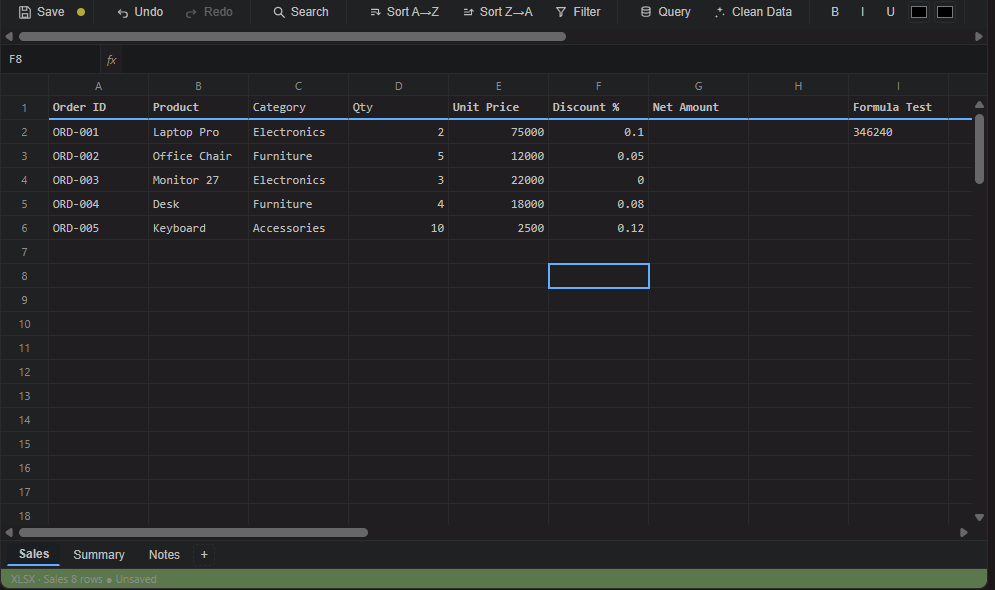
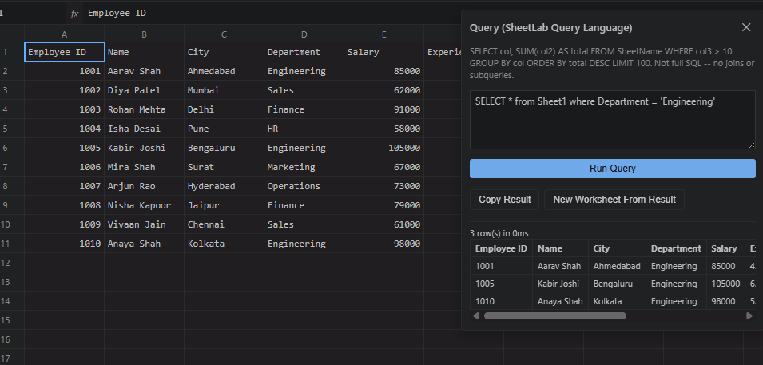
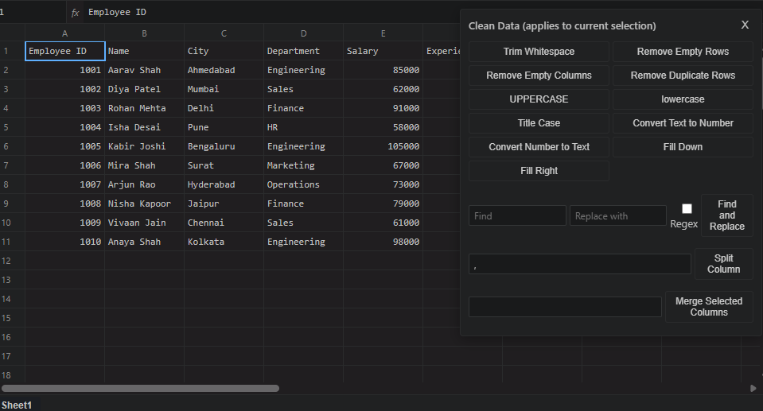
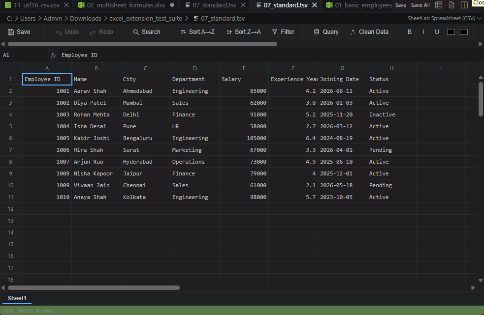

# SheetLab — Excel Viewer & Query

[](https://github.com/AnandShah10/sheetlab/stargazers)
[](https://github.com/AnandShah10/sheetlab/network/members)
[](https://github.com/AnandShah10/sheetlab/issues)
[](https://github.com/AnandShah10/sheetlab/blob/main/LICENSE)

**Excel-like spreadsheet viewing, editing, and querying for XLSX/XLS/XLSM inside VS Code. Plus an opt-in spreadsheet view for CSV/TSV that *never* hijacks the normal text editor.**

> **Made with ❤️ by Anand Shah for the developer community**

## ✨ Features

- **Virtualized high-performance grid** — Handles 100k+ rows smoothly (only renders visible rows)
- **Real formula engine** — Powered by HyperFormula (SUM, VLOOKUP, IF, INDEX/MATCH, and 100+ more functions)
- **Multi-worksheet support** — Create, rename, reorder, delete sheets in Excel workbooks
- **Powerful data tools** — Sort, filter, search (with regex), data cleaning (dedupe, trim, case tools, split columns, etc.)
- **Excel Tables** — Create/manage tables with structured references in formulas
- **Freeze panes, cell formatting, row/column resize, hide/show**
- **SQL-like Query Language** — Run analytical queries with results in a separate non-destructive view
- **Full undo/redo** — Application-level, works with VS Code's text undo for CSVs
- **Dark/Light/High-contrast themes** that follow VS Code
- **Zero telemetry by default** — No network calls, no data exfiltration (ever)

**Perfect for data analysts, developers, and anyone who works with tabular data in VS Code.**

## 📸 Screenshots


*Full Excel-like spreadsheet experience with formula bar, sheet tabs, formatting, and virtualized grid*


*Powerful SQL-like query interface with non-destructive results*


*One-click data cleaning tools (trim, deduplicate, case tools, fill, split columns, etc.)*


*Opt-in spreadsheet view for CSV/TSV files that never hijacks the normal text editor*

## 🚀 Quick Start

### For Excel Files (`.xlsx`, `.xlsm`, `.xls`)
- Simply open any Excel file — SheetLab launches automatically as the default editor
- Use the toolbar, right-click context menu, or commands for full spreadsheet functionality
- **Save** (`Ctrl/Cmd + S`) writes changes back to the original file

### For CSV/TSV Files (Opt-in only)
1. Open your `data.csv` — it opens as a **normal text editor** (as always)
2. Click the **"Open as Spreadsheet"** button in the editor title bar (or use Command Palette: `SheetLab: Open as Spreadsheet`)
3. Enjoy the full grid experience with formulas, queries, cleaning tools, etc.
4. **Save** to write back to the original CSV (preserving delimiter, encoding, quotes)
5. Click **"Open as Text"** anytime to return to the plain-text view

> **Important**: SheetLab never converts your CSV to XLSX. Both views edit the *same* underlying `TextDocument`.

## Query Syntax (SheetLab Query Language)

```sql
SELECT Department, SUM(Sales) AS TotalSales
FROM Sheet1
WHERE Sales > 1000
GROUP BY Department
ORDER BY TotalSales DESC
LIMIT 100
```

See full syntax details, supported functions, and limitations in the detailed sections below.

## Key Capabilities

### Supported File Types

| File Type | Read | Edit/Save | Notes |
|-----------|------|-----------|-------|
| `.xlsx`   | Yes  | Yes       | Full support via ExcelJS |
| `.xlsm`   | Yes  | Yes*      | *Macro safety confirmation required before save |
| `.xls`    | Yes  | Export only | Legacy format — use "Export as XLSX" |
| `.csv`    | Yes  | Yes       | **Opt-in** spreadsheet view only |
| `.tsv`    | Yes  | Yes       | Same as CSV, tab-delimited |

### Formula Support
Real calculation using HyperFormula. Supports 100+ functions including:
- Math: `SUM`, `SUMIF/SUMIFS`, `AVERAGE`, `ROUND*`
- Logic: `IF`, `IFS`, `AND`, `OR`, `NOT`, `IFERROR`
- Lookup: `VLOOKUP`, `HLOOKUP`, `INDEX`, `MATCH`
- Text, Date, Statistical functions

**Structured references** from Excel Tables (`Table1[Column]`, `Table1[@Column]`, etc.) are also supported.

### Data Tools
- **Cleaning**: Trim whitespace, remove duplicates/empty rows/cols, case conversion, fill down, split/merge columns
- **Formatting**: Bold, colors, borders, number formats (with live preview)
- **Navigation**: Go to Cell (`Ctrl/Cmd+G`), Workbook Search (`Ctrl/Cmd+F`)
- **All operations are undoable**

## Configuration

All settings are prefixed with `sheetlab.`:

- CSV parsing options (delimiter, encoding, quote char, header detection)
- Grid appearance (theme, font size, row height, column width, gridlines)
- Performance tuning (`maxRowsInMemory`, chunk size)
- Formula calculation toggle
- Telemetry (off by default, anonymous only)

Full list available in `package.json` or VS Code Settings (search for "SheetLab").

## Keyboard Shortcuts (in Spreadsheet View)

| Shortcut | Action |
|----------|--------|
| `Ctrl/Cmd + F` | Search Workbook |
| `Ctrl/Cmd + G` | Go To Cell |
| `Ctrl/Cmd + S` | Save Spreadsheet |
| `F2` / `Enter` | Edit cell |
| `Ctrl/Cmd + Shift + Q` | Run Query |

## Known Limitations

- No charts, pivot tables, or advanced conditional formatting
- ODS not supported
- Very large files (>500k rows) are truncated (configurable)
- XLSM macros are preserved only on explicit confirmation (ExcelJS limitations)
- Query language is a focused SQL *subset* (no JOINs, subqueries, etc.)

See the full [architecture](#architecture) and detailed limitation notes below for transparency.

## The One Thing to Know About CSVs

**CSV and TSV files open as normal text files by default.** SheetLab does not intercept or hijack them. Use the **"Open as Spreadsheet"** command/icon when you want the full grid experience.

The spreadsheet is a *view* of the same file — edits are synchronized through VS Code's `TextDocument`. No silent conversions ever occur.

## Detailed Documentation

- [Query Language Reference](#query-syntax-sheetlab-query-language)
- [Formula Support Details](#formula-support)
- [XLSM Safety](#xlsm-safety)
- [Architecture](#architecture)
- [Development](#development)
- [Privacy & Security](#privacy--security)

*(The original comprehensive documentation follows below — optimized for both GitHub and the VS Code Marketplace)*

---

## Features (Detailed)

*(The full feature list from the original README is preserved here for completeness)*

- Virtualized spreadsheet grid (row numbers, column letters, resizable columns, freeze panes, gridlines toggle) that stays responsive at hundreds of thousands of rows because it only renders the rows currently on screen
- Formula bar and name box (`A1`, `B25`, `A1:F20` navigation)
- Multi-worksheet support for Excel workbooks: switch/create/rename/delete/reorder sheets
- Real formula evaluation (HyperFormula) — SUM/SUMIF/SUMIFS, COUNT family, AVERAGE/MIN/MAX, ROUND family, IF/IFS/AND/OR/NOT/IFERROR, text functions, date basics, VLOOKUP/HLOOKUP/INDEX/MATCH, and more. Formulas HyperFormula can't parse show as `#UNSUPPORTED!` rather than a guessed value, and the original formula text is preserved on save either way.
- Sort (multi-key, row-integrity preserving), filter, search/find-replace (regex, case-sensitive, whole-cell, workbook-wide)
- Data cleaning: trim, remove empty rows/columns, remove duplicates, case normalization, find/replace, text↔number conversion, fill down/right, split/merge columns — all undoable
- Row/column insert and delete, with cell indices shifted correctly (right-click context menu, or the toolbar/commands)
- Hide/show rows and columns, with "Show All Hidden Rows/Columns" to restore visibility in bulk
- Cell formatting (bold/italic/underline, font color, background color, borders, and number format — presets plus a free-text custom code) from the toolbar, applied to the current selection and rendered in the grid
- Excel Tables: create/remove a named table over a selection (optionally marking a totals row), with visual boundary borders and header-row styling in the grid, plus structured reference support in formulas — `Table1[Column]`, `Table1[@Column]`, `Table1[#All]`, `Table1[#Headers]`, `Table1[#Totals]`, `Table1[#Data]`, and multi-column selectors like `Table1[[Col1]:[Col2]]` — see Limitations for the exact scope
- Freeze panes with real visual pinning in the grid, including the row-number gutter for frozen rows and drag-to-select across the frozen/unfrozen boundary: frozen rows/columns stay on screen while the rest of the sheet scrolls
- Row resizing (drag the row-header bottom edge), matching the existing column resize
- Column and row header interactions: click a header to select the whole column/row; right-click for a header-specific menu (insert/delete/hide, and — for columns — sort the sheet by that column)
- A right-click context menu on the grid: cut/copy/paste, clear contents, insert/delete row, insert/delete column, hide row/column, show all hidden, create/remove table
- A small SQL-like query language (see below) with a non-destructive result grid you can copy or push into a new worksheet
- Application-level undo/redo (not just the browser's), working alongside VS Code's own text-document undo for CSV
- Copy/paste compatible with Excel/Sheets clipboard format (tab-separated, quote-escaped, embedded-newline-safe)
- Dark/light/high-contrast theming via VS Code's own CSS variables
- Strict Webview CSP, no network access, no telemetry by default

## Supported file types

*(Table preserved from original)*

| Type   | Read | Write | Notes |
|--------|------|-------|-------|
| `.xlsx`| Yes  | Yes   | Full read/write via ExcelJS |
| `.xlsm`| Yes  | Yes*  | *Requires confirmation if the file has a VBA project — see [XLSM safety](#xlsm-safety) |
| `.xls` | Yes  | No    | Legacy binary format — view/query/copy only; **Save** offers "Export as XLSX" instead of in-place overwrite |
| `.csv` | Yes  | Yes   | Opt-in spreadsheet view; stays a normal text file otherwise |
| `.tsv` | Yes  | Yes   | Same as CSV, tab-delimited |

ODS is not supported in this version.

## Opening CSV as a spreadsheet

*(Full section from original preserved — this is critical UX information)*

1. Open `data.csv` — it's a normal VS Code text editor, as always.
2. Click **Open as Spreadsheet** (or run the command). SheetLab opens a grid view of the *same file*.
3. Sort, filter, search, clean, query, edit.
4. Save (`Ctrl+S` / `Cmd+S`) — writes back to `data.csv`, preserving the detected delimiter, quoting, line endings, and encoding.
5. **Open as Text** any time to return to the plain editor — it shows exactly what you just edited, because both views share the same `vscode.TextDocument`.

*(Architecture note about CustomTextEditorProvider preserved in full in the original detailed section below)*

## Query syntax (SheetLab Query Language)

*(Full details from original preserved)*

A deliberately small SQL-like subset — **not** full SQL.

**Supported:**
- `SELECT` (columns, `*`, aggregates with `AS`)
- `FROM <sheet>`
- `WHERE` with comparison operators + `AND`/`OR`
- `GROUP BY`, `ORDER BY`, `LIMIT`

See original README for examples and explicit non-supported features.

## Formula support, Data cleaning, Keyboard shortcuts, Settings, Known limitations, XLSM safety, Architecture, Development, Testing, Privacy & Security

*(All detailed sections from the original comprehensive README are preserved below for developers and power users. The top of this file has been optimized specifically for the VS Code Marketplace showcase.)*

---

## Architecture

```
src/
  extension.ts                  activation entry point
  commands/                     thin command-palette wrappers
  editors/
    excelCustomEditor/          CustomEditorProvider for xlsx/xlsm/xls
    csvSpreadsheetEditor/       CustomTextEditorProvider for csv/tsv
    shared/                     CSP-locked webview HTML shell
  workbook/                     in-memory model + mutation helpers
  excel/                        ExcelJS reader/writer, legacy .xls reader, XLSM safety gate
  csv/                          delimiter detection, PapaParse reader/writer, TextDocument sync
  query/                        SLQL tokenizer/parser + execution engine
  formula/                      HyperFormula wrapper
  data/                         sort, filter, cleanup, aggregation
  services/                     undo stack, save (atomic rename), conflict watcher,
                                 clipboard, search, settings, active-panel registry
  types/                        shared Cell/Worksheet/Workbook model + webview message protocol
  utils/                        A1 reference parsing

webview/src/
  app/            entry point, VS Code API wrapper, cell-ref helpers
  grid/           virtualized grid + clipboard
  formulaBar/ nameBox/ sheetTabs/ toolbar/   UI chrome
  search/ query/ dataCleaning/ contextMenu/  feature panels
  state/          observable app state store
```

*(Full original content for Development, Testing, Linting, Packaging, Privacy & Security sections preserved for completeness — see the previous version of this file or the GitHub repository history.)*

## Additional Resources

- [CHANGELOG.md](CHANGELOG.md)
- [CONTRIBUTING.md](CONTRIBUTING.md)
- [LICENSE](LICENSE)
- [GitHub Repository](https://github.com/AnandShah10/sheetlab)
- [Report Issues](https://github.com/AnandShah10/sheetlab/issues)

---

**Made with ❤️ by Anand Shah for the developer community**

This extension was built to bring the joy of spreadsheet productivity into every developer's favorite editor. Thank you for being part of the community!

*SheetLab — Because sometimes you just need a spreadsheet without leaving VS Code.*
